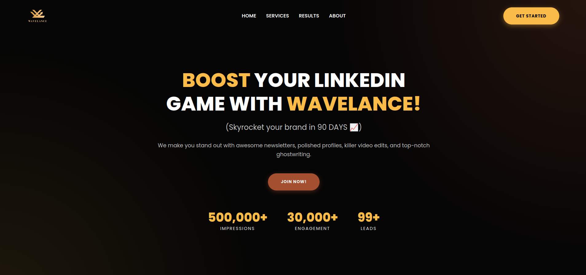
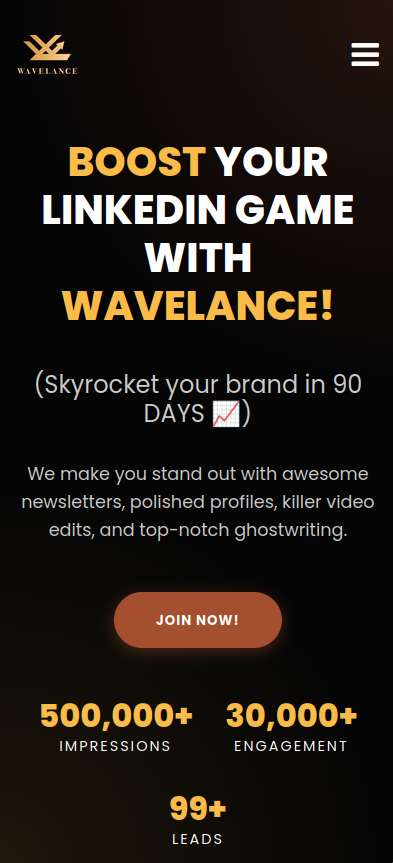

<h1 align="center">Wavelance</h1>

A landing page built for Afreen Dharar, a LinkedIn personal branding strategist. She wanted a clean page that showcased her success with past clients, free of distracting elements, and that's what I delivered. She later rebranded, so the site is no longer in use, but it remains part of my portfolio.

## Links

- [Repo](https://github.com/marinsabo/Wavelance "Wavelance Repo")
- [Live](https://marinsabo.github.io/Wavelance/ "Live View")

## Screenshots

## Built With

- HTML5
- CSS3

## AI Usage

I didn't use any AI in this project. The page copy was written by Afreen, so I can't speak to whether AI was used there.
